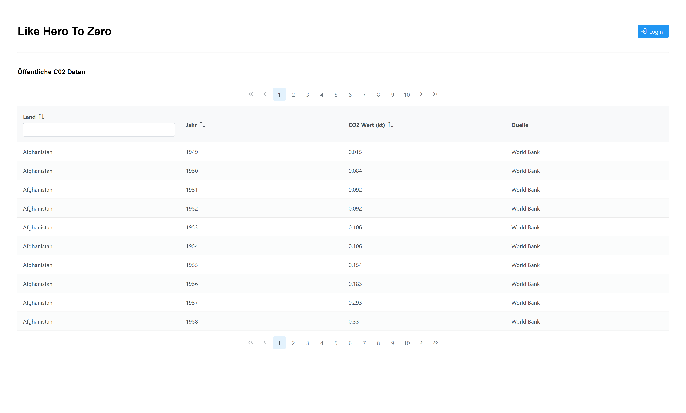
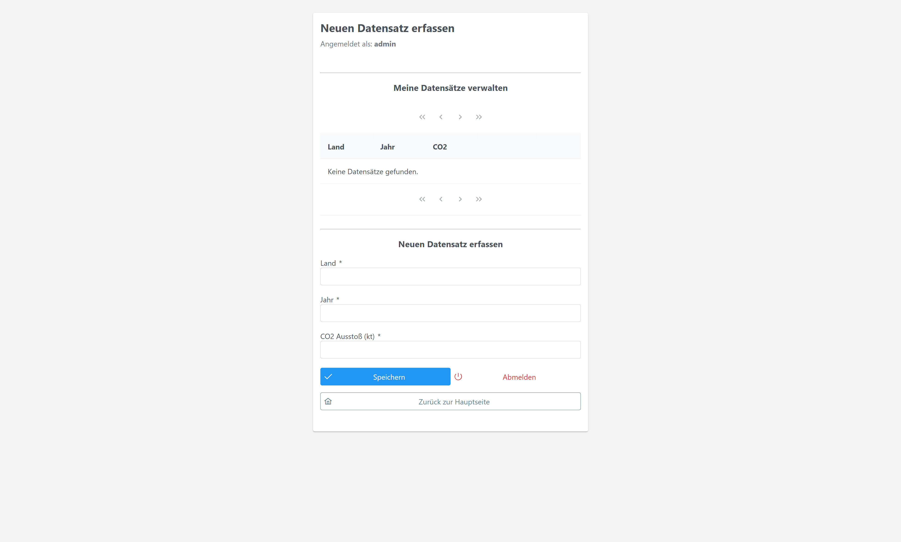
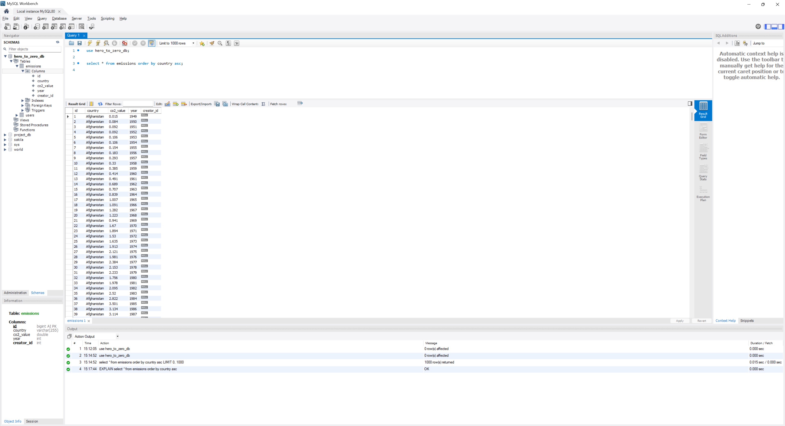
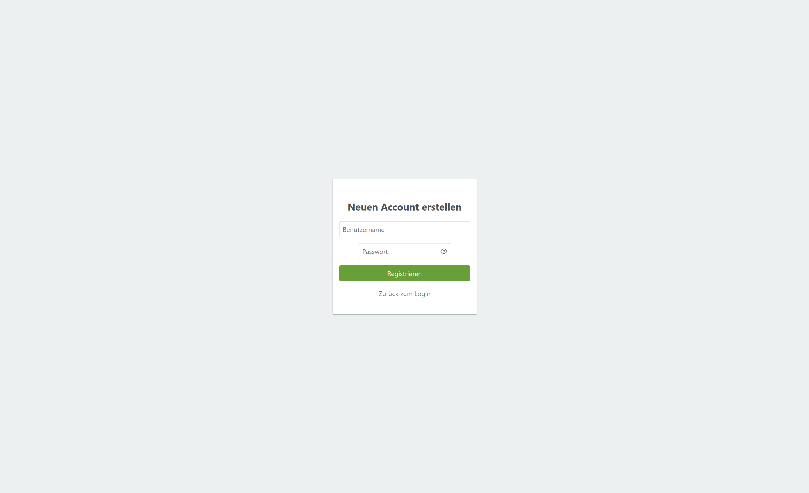

# Like Hero To Zero - CO2 Emissions Manager

Eine Enterprise Webanwendung zur Verwaltung und Analyse von weltweiten CO2-Emissionsdaten. Entwickelt als Fallstudie im Modul Software Engineering.

Die Anwendung ermöglicht es, öffentliche Emissionsdaten einzusehen und bietet den Nutern einen geschützten Bereich, um eigene Daten zu erfassen und zu verwalten.

---

## 📊 Datenquelle & Lizenz

Die in diesem Projekt verwendeten CO2-Emissionsdaten stammen aus dem Repository von **Our World in Data** (OWID).

* **Datensatz:** Data on CO2 and greenhouse gas emissions
* **Hauptquelle:** Global Carbon Project (GCP) & Jones et al.
* **Autoren:** Pablo Rosado, Hannah Ritchie, Max Roser, Edouard Mathieu, Bobbie Macdonald
* **Lizenz:** Creative Commons Attribution 4.0 (CC-BY 4.0)
* **URL:** [https://github.com/owid/co2-data](https://github.com/owid/co2-data)

---

## 🛠 Technologien

Das Projekt basiert auf einer modernen **3-Schichten-Architektur (MVC)**:

* **Frontend:** Jakarta Server Faces (JSF 4.0), PrimeFaces 14.0
* **Backend:** Jakarta EE (CDI, Managed Beans), Java 21
* **Datenbank:** MySQL 8.4, Hibernate (JPA)
* **Server:** Apache TomEE 10 (Plume/Plus)
* **Build Tool:** Maven

---

## ✨ Features

* **Öffentlicher Bereich:**
    * Anzeige von tausenden Emissionsdatensätzen (Importiert von Our World in Data).
    * Filterung und Sortierung der Daten in Echtzeit.
* **Interner Bereich (für Wissenschaftler):**
    * Sicherer Login & Logout (Session Management).
    * **CRUD-Funktionalität:** Erstellen, Lesen, Aktualisieren und Löschen eigener Datensätze.
    * **Inline-Editing:** Bearbeitung von Werten direkt in der Datentabelle.
    * Automatische Zuordnung: Neue Datensätze werden dem eingeloggten Nutzer zugewiesen.
* **Benutzerverwaltung:**
    * Registrierung neuer Nutzer über die Oberfläche.

---

## 🚀 Installation & Start

### 1. Voraussetzungen
* Java Development Kit (JDK) 21
* IntelliJ IDEA (Ultimate Edition empfohlen für Java-EE-Support)
* MySQL Server (Community Edition) & MySQL Workbench
* Apache TomCat 10.x (Jakarta-EE-kompatible)

### 2. Datenbank-Initialisierung
1.  Schema erstellen: Öffnen Sie die MySQL Workbench und führen Sie folgenden Befehl aus:
    ```sql
       * CREATE DATABASE IF NOT EXISTS hero_to_zero_db;
       * USE hero_to_zero_db;
    ```
2.  CSV-Datei importieren:
   * Rechtsklick auf das Schema `hero_to_zero_db` -> **Table Data Import Wizard**.
   * Wählen Sie die CSV-Datei aus dem Ordner `/src/main/ressources` aus.
   * Wählen Sie **"Create new table"** und nenne Sie diese co2_data.
   * **Wichtiges Mapping:** Achten Sie darauf, dass die Spalte co2 als Datentyp **double** oder **decimal** (nicht text!) erkannt wird.
   * Stellen Sie das Encoding auf **UTF-8** und schließen Sie den Import ab.

3.  **Server-Konfiguration (JNDI)**
   * Das Projekt nutzt eine JTA-Datenquelle mit dem Namen mysqlDS. Diese Ressource muss im Tomcat-Server definiert werden, damit die `persisitence.xml` die Verbindung herstellen kann.
     * Öfnnen Sie die Datei `context.xml` Ihres Tomcats (entweder im globalen `/conf`-Ordner oder direkt in der IntelliJ-Run-Configuration).
     * Fügen Sie das folgende `<Ressource>`-Tag innerhalb des `<Context>`-Blocks ein:
     ``` xml
     <Resource name="jdbc/mysqlDS" 
          auth="Container" 
          type="javax.sql.DataSource" 
          driverClassName="com.mysql.cj.jdbc.Driver"
          url="jdbc:mysql://localhost:3306/hero_to_zero_db"
          username="IHR_NUTZERNAME" 
          password="IHR_PASSWORT" 
          maxTotal="20" maxIdle="10" />
     ```
     

### 4. IntelliJ & Deployment-Setup
* **Projekt öffnen:** Importieren Sie das Repository als Maven-Projekt.
* **Run-Konfiguration erstellen:**
  * Erstellen Sie eine neue **TomCat Server (Local)** Konfiguration.
  * Im Tab **Deployment:** Klicken Sie auf das **"+"** Artifact und wählen Sie `WebApp:war exploded`aus.
  * Setzen Sie den **Application context** auf `/WebApp_war_exploded`.
* **Hinweis zu Hibernate:** Die Einstellung `hibernate.hbm2ddl.auto` steht auf `update`. Dadurch werden zusätzliche Tabellen (wie die `users`-Tabelle) beim ersten Start automatisch erstellt, ohne Ihre importierten CO2-Daten zu löschen.

### 5. Starten der Applikation
* Starten Sie den Tomcat-Server über den **Run**-Button in IntelliJ.
* Die App ist erreichbar unter `http://localhost:8080/WebApp_war_exploded`
* Die SQL-Logs können in der IntelliJ-Konsole verfolgt werden (aktiviert via `hibernate.show_sql`)

---

## 🗄 Datenbank Struktur

Die Anwendung nutzt zwei zentrale Tabellen:

### 1. `emissions` (Emissionsdaten)
Beinhaltet die CO2-Werte.
* **Quellen:** Our World in Data (Import) und User-Eingaben.
* **Unterscheidung:** Importierte Daten haben `creator_id = NULL`.

### 2. `users` (Benutzer)
Verwaltet die Zugangsdaten der Benutzer.
* **Spalten:** `id` (Auto-Increment), `username`, `password`.
* **Hinweis:** Diese Tabelle wird beim ersten Start durch Hibernate automatisch erstellt (wenn in `persistence.xml` konfiguriert). Sie ist initial leer. Bitte die **Registrieren-Funktion** auf der Login-Seite nutzen, um einen ersten Benutzer anzulegen.

---

## 📸 Screenshots

### Startseite


### Login


### Interner Bereich (Datenverwaltung & Inline-Editing)


### Datenbank 


### Sign Up 
